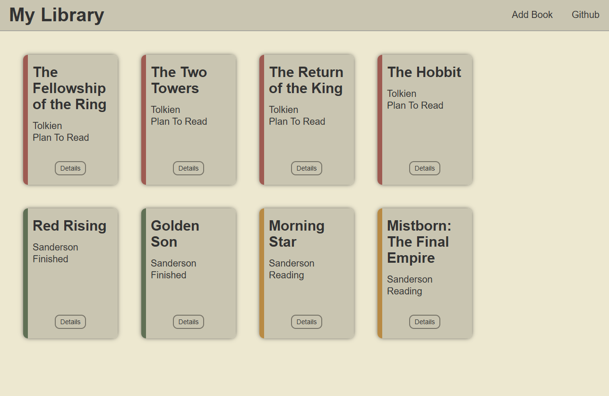

# Personal Library App

**[View Live Demo](https://merlindeadleft.github.io/odin-library/)**

 

 

A frontend web application built to manage a personal book collection. This project demonstrates core Object-Oriented Programming (OOP) principles in JavaScript, managing application state, and dynamically rendering data to the UI.

Built as part of [The Odin Project](https://www.theodinproject.com/) curriculum to solidify data structure management and complex DOM manipulation. (Eighth project, third on the node path [Link to project instructions](https://www.theodinproject.com/lessons/node-path-javascript-library))

## Key Features & Technologies

- Vanilla JavaScript: Utilizing object constructors/classes, array manipulation, and event handling.
- State Management: Keeping the user interface synchronized with the underlying data model (book array).
- Dynamic DOM Rendering: Generating and removing HTML elements on-the-fly based on user interaction.
- Form Handling: Capturing user input to create new data objects and immediately updating the view.
- HTML5 & CSS3: Clean and responsive UI design for visualizing the collection.

## Development / Installation

This is a vanilla frontend project without a build step. To run it locally:

1. Clone the repository
2. Open `index.html` in your web browser